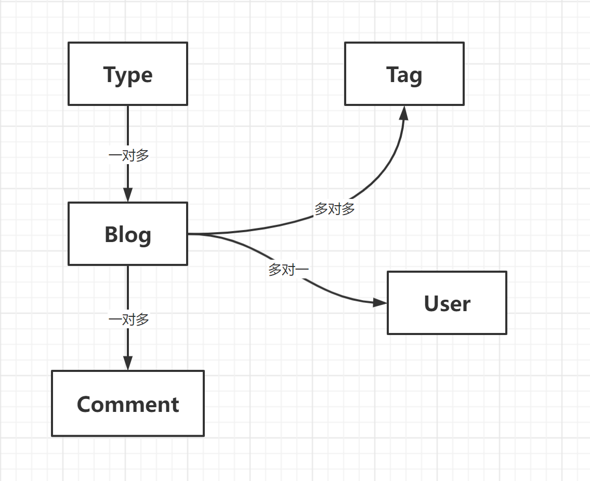
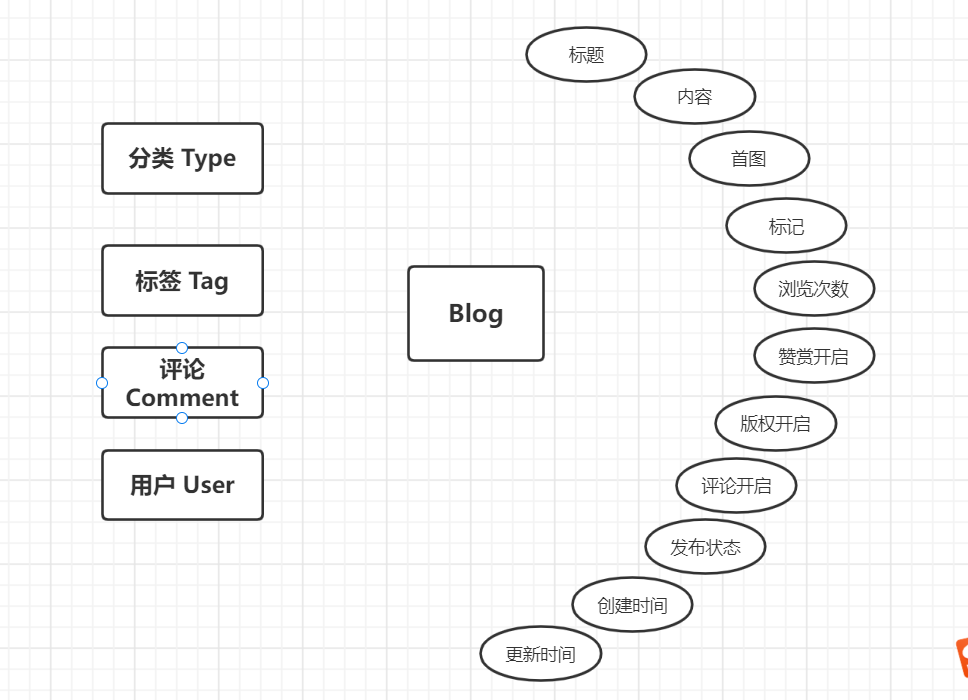
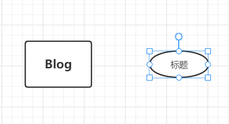
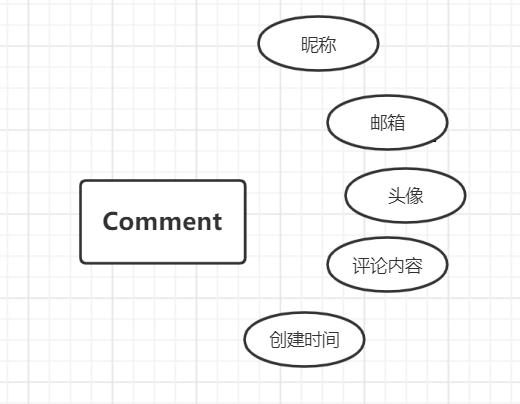
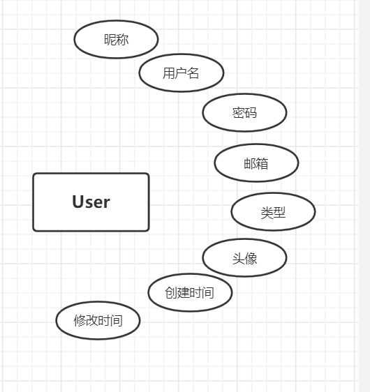

## 个人博客

技术组合：

- 后端：SpringBoot + JPA + thymeleaf模块
- 数据库：MySQL
- 前段UI： Semantic UI 框架


工具与环境：

- IDEA
- Maven 5.6
- JDK8
- Axure RP 8

## 1、需求与功能

角色：普通访客、管理员（我）

访客：

- 可以分页查看所有的博客
- 可以快速查看博客数最多的6个分类
- 可以查看所有的分类
- 可以查看标记博客最多的10个标签
- 可以查看所有的标签
- 可以查看所有标签下的博客列表
- 可以根据年度时间线查看博客列表
- 可以快速查看最新的推荐博客
- 可以使用关键字全局搜索博客
- 可以查看单个博客内容
- 可以对博客内容进行评论
- 可以赞赏博客内容
- 可以微信扫描阅读博客内容
- 可以在首页扫描公众号、二维码关注我

管理员

- 可以用户名和密码登录后台管理
- 管理博客
  - 发布新博客
  - 对博客进行分类
  - 对博客打标签
  - 修改博客
  - 删除博客
  - 根据标题，分类，标签查询博客
- 博客分类
  - 新增
  - 修改
  - 插入
  - 删除
- 管理标签
  - 新增
  - 修改
  - 删除
  - 查新 

## 2、思维导图


## 3、页面设计与开发


前段展示：首页、详情页、分类、标签、归档、关于我

后端管理：模板页


## 4、插件引入

1、Markdown编辑器

 [Editor.md - 开源在线 Markdown 编辑器 (pandao.github.io)](https://pandao.github.io/editor.md/)

2、排版

 [sofish/typo.css: 中文网页重设与排版：一致化浏览器排版效果，构建最适合中文阅读的网页排版 (github.com)](https://github.com/sofish/typo.css)

3、动画

 [animate-css/animate.css: 🍿 A cross-browser library of CSS animations. As easy to use as an easy thing. (github.com)](https://github.com/animate-css/animate.css)

4、代码高亮

[Prism (prismjs.com)](https://prismjs.com/)

5、目录生成

6、二维码插件

[davidshimjs/qrcodejs: Cross-browser QRCode generator for javascript (github.com)](https://github.com/davidshimjs/qrcodejs)

7、平滑滚动

[flesler/jquery.scrollTo: Lightweight, cross-browser and highly customizable animated scrolling with jQuery (github.com)](https://github.com/flesler/jquery.scrollTo)

8、滚动侦测

[Waypoints (imakewebthings.com)](http://imakewebthings.com/waypoints/)


## =======后端部分=======

## 5、框架搭建

### 1、引入Spring Boot模块

- web
- Thymeleaf
- JAP /Mybatis
- MySQL
- Aspects
- DevTools

### 2、application.yaml 配置


```yaml
# 数据库链接
spring:
  datasource:
    driver-class-name: com.mysql.cj.jdbc.Driver
    url: jdbc:mysql://47.94.220.33:3306/blog?useUnicode=true&characterEncoding=utf-8
    username: root
    password: 123456

# MyBatis配置
mybatis:
  # 搜索指定包别名
  typeAliasesPackage: com.ruoyi.**.domain
  # 配置mapper的扫描，找到所有的mapper.xml映射文件
  mapperLocations: classpath*:mapper/**/*Mapper.xml
  # 加载全局的配置文件
  configLocation: classpath:mybatis/mybatis-config.xml

# 日志
logging:
  level:
    root: info
    com.wukong: debug
```

### 3、logback-spring.xml

```xml
<?xml version="1.0" encoding="UTF-8"?>
<configuration>
    <!--    包含Springboot对logback日志的默认配置-->
    <include resource="org/springframework/boot/logging/logback/defaults.xml" />
    <property name="LOG_FILE" value="${LOG_FILE:-${LOG_PATH:-${LOG_TEMP:-${java.io.tmpdir:-/tmp}}}/spring.log}"/>
    <include resource="org/springframework/boot/logging/logback/console-appender.xml" />
    <!--    重写org/springframework/boot/logging/file-appender.xml-->
    <appender name="TIME_FILE"
              class="ch.qos.logback.core.rolling.RollingFileAppender">
        <encoder>
            <pattern>${FILE_LOG_PATTERN}</pattern>
        </encoder>
        <file>${LOG_FILE}</file>
        <rollingPolicy class="ch.qos.logback.core.rolling.TimeBasedRollingPolicy">
            <fileNamePattern>${LOG_FILE}.%d{yyyy-MM-dd}.%i</fileNamePattern>
            <!--  保留时间_天-->
            <maxHistory>30</maxHistory>
            <!--  分割大小-->
            <timeBasedFileNamingAndTriggeringPolicy class="ch.qos.logback.core.rolling.SizeAndTimeBasedFNATP">
                <maxFileSize>10MB</maxFileSize>
            </timeBasedFileNamingAndTriggeringPolicy>
        </rollingPolicy>
    </appender>
    <root level="INFO">
        <appender-ref ref="CONSOLE"></appender-ref>
        <appender-ref ref="TIME_FILE"></appender-ref>
    </root>

</configuration>
```

## 6、异常处理

### 1、定义异常处理页面

- 404 （页面资源找不到）
- 500 （Spring后台错误信息）
- error （自己定义的错误信息）


### 2、错误页面拦截类


```java
/**
 * 错误页面拦截类
 * @ControllerAdvice 会拦截到所有标注 @Controller的类
 */
@ControllerAdvice
public class ControllerExceptionHandler {

    private Logger logger = LoggerFactory.getLogger(this.getClass());

    /**
     * 拦截错误并返回到 error页面
     * @ExceptionHandler(Exception.class) 异常处理注解，里面的参数是拦截Exception级别的错误信息
     * @param request
     * @param e
     * @return
     */
    @ExceptionHandler(Exception.class)
    public ModelAndView exceptionHandler(HttpServletRequest request,Exception e){

        logger.error("Request URL: {}, Exception: {}",request.getRequestURL(),e);

        ModelAndView mv = new ModelAndView();
        //添加异常信息
        mv.addObject("url",request.getRequestURL());
        mv.addObject("exception",e);
        //设置返回页面
        mv.setViewName("error/error");
        return  mv;
    }
}
```


### 3、错误页面异常信息显示处理

```html
<div>
    <div th:utext="'&lt;!--'" th:remove="tag"></div>
    <div th:utext="'Failed Request URL :' + ${URL}" th:remove="tag"></div>
    <div th:utext="'Exception message' + ${exception.message}" th:remove="tag"></div>
    <ui th:remove="tag">
        <li th:each="st : ${exception.stackTrace}" th:remove="tag"><span th:utext="${st}" th:remove="tag"></span></li>
    </ui>
    <div th:utext="'--&gt;'" th:remove="tag"></div>
</div>
```

### 4、资源找不到异常类

```java
/**
 * 自定义异常类
 */
@ResponseStatus(HttpStatus.NOT_FOUND)
public class MyNotFoundException extends RuntimeException {

    public MyNotFoundException() {
    }

    public MyNotFoundException(String message) {
        super(message);
    }

    public MyNotFoundException(String message, Throwable cause) {
        super(message, cause);
    }
}
```

## 7、日志处理

> 采用 aop 进行日志处理

### 1、记录日志内容

- 请求的URL
- 访问者 ip
- 调用方法 classMethod
- 参数 args
- 返回内容


### 2、记录日志类


```java
package com.wukong.aspect;

import org.aopalliance.intercept.Joinpoint;
import org.aspectj.lang.JoinPoint;
import org.aspectj.lang.annotation.*;
import org.slf4j.Logger;
import org.slf4j.LoggerFactory;
import org.springframework.stereotype.Component;
import org.springframework.web.context.request.RequestContextHolder;
import org.springframework.web.context.request.ServletRequestAttributes;

import javax.servlet.http.HttpServletRequest;
import java.util.Arrays;

/**
 *  aop
 * 日志处理
 */
@Aspect
@Component
public class LoginAspect {

    private final Logger logger = LoggerFactory.getLogger(this.getClass());

    /**
     * @Pointcut 定义管理切和入点
     */
    @Pointcut("execution(* com.wukong.web.*.*(..))")
    public void log(){

    }

    /**
     * 方法之前输出
     */
    @Before("log()")
    public void doBefore(JoinPoint joinpoint){

        //获取 url和ip
        ServletRequestAttributes attributes =
                (ServletRequestAttributes) RequestContextHolder.getRequestAttributes();
        HttpServletRequest request = attributes.getRequest();
        String url = request.getRequestURL().toString();
        String ip = request.getRemoteAddr();

        //获取类的方法
        String classMethod =
                joinpoint.getSignature().getDeclaringTypeName() + "." +joinpoint.getSignature().getName();
        //获取请求参数
        Object[] args = joinpoint.getArgs();

        //封装
        RequestLog requestLog = new RequestLog(url, ip, classMethod, args);

        logger.info("Result : {}",requestLog);
//        logger.info("-----------doBefore--------------");
    }

    /**
     * 方法之后输出
     */
    @After("log()")
    public void doAfter(){
//        logger.info("-----------doAfter--------------");
    }

    /**
     * 方法执行完返回的内容
     */
    @AfterReturning(returning = "result",pointcut = "log()")
    public void doAfterReturn(Object result){
        logger.info("Result : {}", result);
    }

    //内部类
    public class RequestLog{
        private String url;
        private String ip;
        private String classMethod;
        private Object[] args;

        public RequestLog(String url, String ip, String classMethod, Object[] args) {
            this.url = url;
            this.ip = ip;
            this.classMethod = classMethod;
            this.args = args;
        }

        @Override
        public String toString() {
            return "{" +
                    "url='" + url + '\'' +
                    ", ip='" + ip + '\'' +
                    ", classMethod='" + classMethod + '\'' +
                    ", args=" + Arrays.toString(args) +
                    '}';
        }
    }
}
```

## 8、页面处理

1、静态页面导入project

2、Thymeleaf布局

- 定义fragment
- 使用fragment布局


## =====admin管理员部分=====

## 1、实体设计

- 博客Blog
- 博客分类Type
- 博客标签 Tag
- 博客评论 Comment
- 用户 User

### 1、表之间的关系




### 2、实体类的设计

#### **Blog**





#### **Tag**




#### Comment





#### User




### 3、分层

  


### 4、命名约定

Service/Dao 层命名的约定

- 获取单个对象的方法用**get**做前缀
- 获取多个对象的方法用**list**做前缀
- 获取统计值的方法用Count做前缀
- 插入的方法用Save （推荐）或 insert做前缀
- 删除的方法用remove（推荐）或者delete做前缀
- 修改的方法用update做  


## 2、登录

1、构建登录页面和后台管理页面

2、UserService 和 UserServiceImpl

3、LoginController实现登录

4、MD5加密

5、登录拦截器

## 3、分类管理

1、分类的管理页面

2、分类类别分页

3、分类新增、修改、删除

## 4、标签管理

1、标签的管理页面

2、标签类别分页

3、标签新增、修改、删除


## 5、博客管理

1、博客分页查询

2、博客新增

3、博客修改

4、博客删除


## ======前段展示=======

### 1、博客首页

### 2、分类页面

### 3、标签页面

### 4、关于我页面

### 5、详情页面

- 评论列表的设计

- 评论信息提交与回复功能
- 评论信息列表展示功能
- 管理员恢复评论功能


